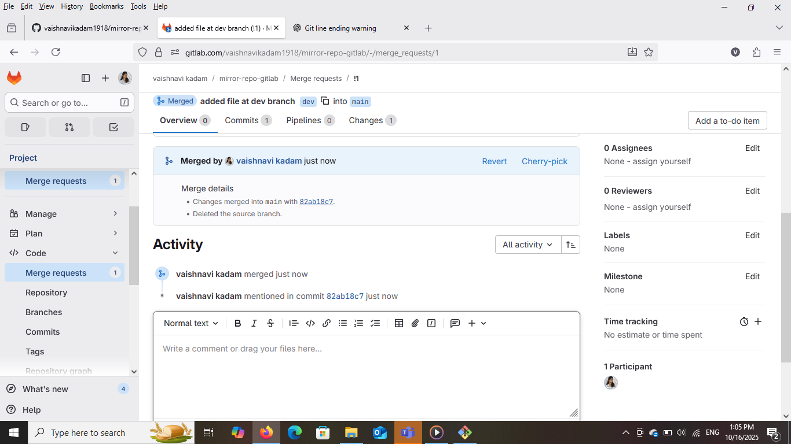
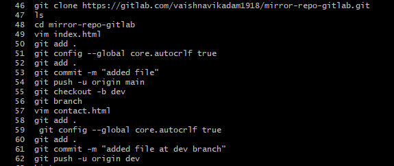

# 🔁 GitLab to GitHub Repository Mirroring Project

This project demonstrates how to set up **automatic mirroring** from a GitLab repository to a GitHub repository.  
All code changes pushed to GitLab are automatically reflected in GitHub using repository mirroring.

---
## 🧩 Project Overview

- **Source Repository:** GitLab → mirror-repo-gitlab  
- **Destination Repository:** GitHub → mirror-repo-github  
- **Main Branch:** main  
- **Second Branch:** dev

---

## ⚙️ Steps Performed

### 1. Repository Creation
- Created `mirror-repo-gitlab` on GitLab.
- Created `mirror-repo-github` on GitHub.

### 2. Mirroring Setup
- In GitLab, went to **Settings → Repository → Mirroring Repositories**.

- Added the GitHub repository link.

- Used **GitHub username** and **Personal Access Token (PAT)** as password.

### 3. Code Push from Git Bash

git add .
git commit -m "Added file"
git push origin main
Pushed index.html to GitLab. 

### 4. Branch and Merge Process
git checkout -b dev

Created a new branch named dev.

Added a new file contact.html, committed, and pushed to GitLab.

Created a Merge Request on GitLab and merged dev → main.

Verified merge reflected on GitHub.

## ✅ Outcome

Successfully mirrored GitLab repository to GitHub.

Branching, commits, and merges are automatically synchronized.

Demonstrated a complete DevOps version control workflow.

## 🚀 Git Commands Used

## 🧠 Conclusion

This project demonstrates how to configure GitLab → GitHub mirroring, automate synchronization, and manage branches using Git Bash and Merge Requests.

## 👩‍💻 Author

#### Vaishnavi Kadam
**GitLab** ➜ [https://gitlab.com/vaishnavikadam1918/mirror-repo-gitlab]

**GitHub** ➜ [https://github.com/vaishnavikadam1918/mirror-repo-github]
